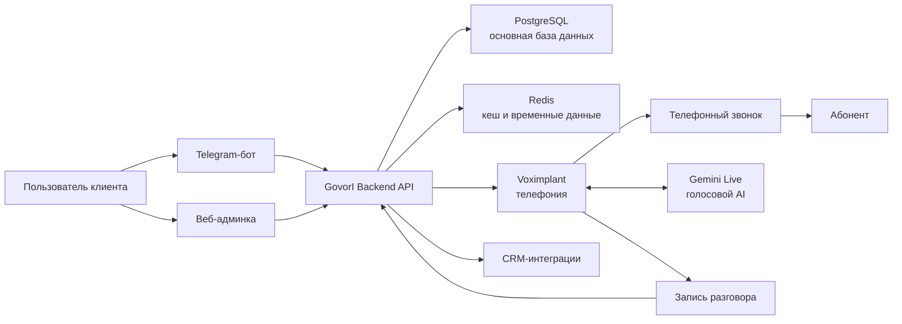
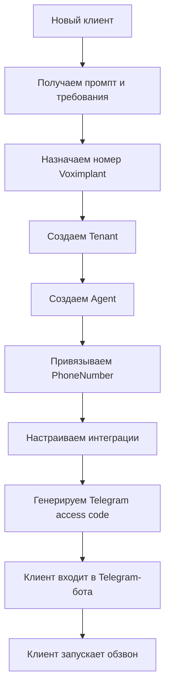
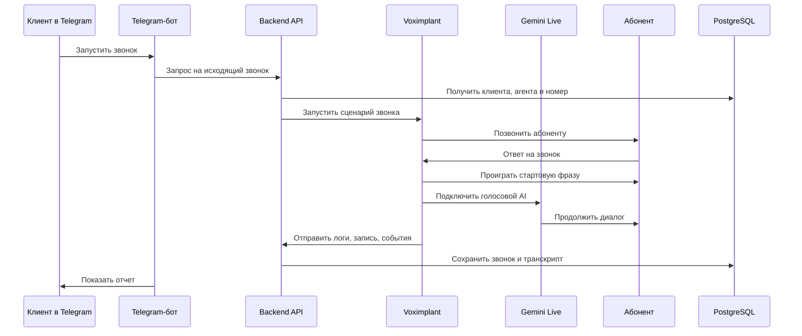
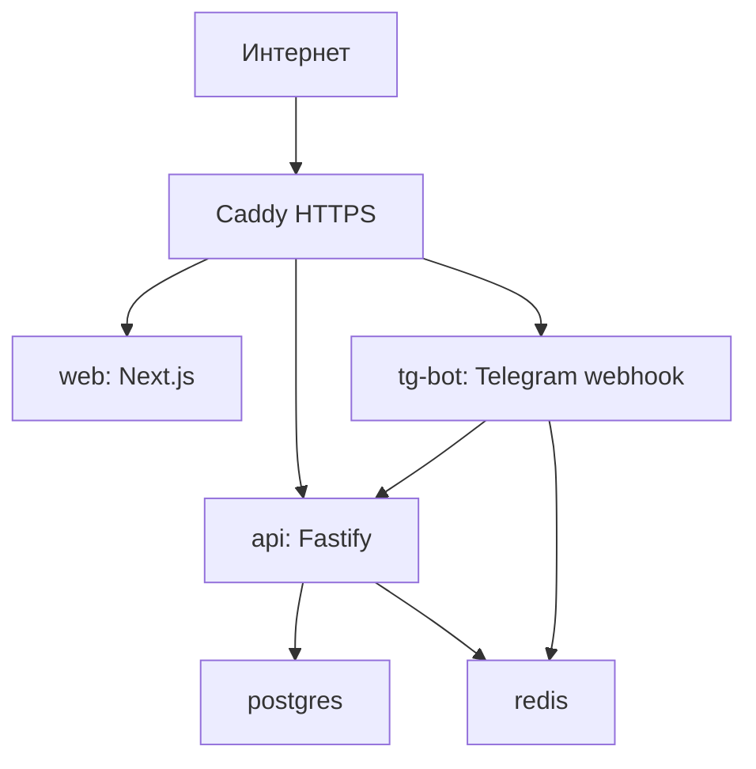

# Архитектура проекта GovorI

Документ для объяснения архитектуры заказчикам, партнерам и внутренней команде.

## 1. Короткое описание проекта

GovorI — это платформа голосовых AI-агентов для бизнеса.

Система позволяет компаниям автоматически совершать и принимать телефонные звонки, вести диалог с клиентами голосом, записывать разговоры, расшифровывать реплики, оценивать заинтересованность абонента и передавать результаты менеджерам или в CRM.

Для конечного клиента все выглядит просто:

1. Клиент получает доступ к Telegram-боту.
2. Запускает обзвон или смотрит результаты.
3. Получает понятный отчет: кто ответил, что сказал, насколько заинтересован, нужна ли передача менеджеру.
4. При необходимости слушает запись разговора.

Вся сложная техническая часть скрыта внутри платформы: телефония, AI, сценарии, записи, база данных, интеграции и серверная инфраструктура.

## 2. Главная ценность для бизнеса

GovorI решает задачу автоматизации первичного телефонного контакта.

Система может использоваться для:

- исходящего обзвона заявок;
- первичной квалификации клиентов;
- подтверждения интереса;
- напоминаний;
- обработки входящих звонков;
- передачи теплых клиентов менеджерам;
- сбора данных перед звонком менеджера;
- интеграции результатов в CRM.

Главная идея: человек-менеджер должен тратить время не на холодные и однотипные разговоры, а на клиентов, которые уже проявили интерес.

## 3. Общая архитектура



Система состоит из нескольких уровней:

- интерфейсы для пользователя;
- backend-ядро;
- телефония;
- голосовой AI;
- база данных;
- отчеты;
- CRM-интеграции;
- инфраструктура деплоя.

## 4. Основные компоненты системы

### 4.1. Telegram-бот

Telegram-бот — основной интерфейс для клиента.

Через него клиент может:

- подключиться к системе по коду доступа;
- запустить исходящий звонок или обзвон;
- посмотреть отчет по звонкам;
- открыть историю разговоров;
- получить запись разговора;
- посмотреть расшифровку: что говорил бот и что говорил человек.

Telegram выбран потому, что клиенту не нужно устанавливать отдельное приложение или разбираться в сложной панели. Он получает привычный интерфейс и может пользоваться системой сразу.

### 4.2. Web-админка

Веб-админка нужна для внутренней команды и расширенного управления.

Через нее можно:

- настраивать клиентов;
- управлять агентами;
- менять промпты;
- смотреть звонки;
- проверять интеграции;
- управлять телефонными номерами;
- подключать CRM;
- анализировать состояние системы.

Для обычного клиента ежедневная работа может происходить только через Telegram-бота. Админка нужна разработчикам, операторам и администраторам платформы.

### 4.3. Backend API

Backend API — центральное ядро платформы.

Он отвечает за:

- авторизацию;
- хранение клиентов;
- хранение AI-агентов;
- привязку телефонных номеров;
- запуск исходящих звонков;
- прием логов от Voximplant;
- сохранение истории звонков;
- хранение транскриптов;
- формирование отчетов;
- работу с Telegram-ботом;
- подключение CRM;
- защиту доступа к записям разговоров.

Backend написан на TypeScript и Fastify. Это дает быстрый HTTP API, строгую структуру модулей и удобное масштабирование.

### 4.4. Voximplant

Voximplant — телефонный слой системы.

Он отвечает за:

- покупку и использование телефонных номеров;
- исходящие звонки;
- входящие звонки;
- соединение с абонентом;
- запись разговора;
- передачу аудио в голосовой AI;
- отправку событий и логов в backend.

В проекте есть два основных сценария Voximplant:

- `voximplant-inbound.js` — сценарий для входящих звонков;
- `voximplant-outbound.js` — сценарий для исходящих звонков.

Когда человек берет трубку, Voximplant сразу проигрывает заранее подготовленную стартовую фразу:

> Здравствуйте, это Ника из Авито продвижения. Есть минутка?

Это сделано для того, чтобы убрать неприятную паузу в начале звонка. Пока проигрывается фраза, система параллельно готовит голосовой AI к диалогу.

### 4.5. Gemini Live

Gemini Live — голосовой AI в реальном времени.

Он используется для:

- понимания речи абонента;
- генерации ответа;
- голосового ответа без отдельного длинного цикла STT -> LLM -> TTS;
- более естественного диалога;
- перебивания и реакции на реплики человека.

Сценарий работы такой:

1. Voximplant соединяется с абонентом.
2. Проигрывается стартовая фраза.
3. Параллельно поднимается Gemini Live-сессия.
4. После стартовой фразы аудио соединяется с AI.
5. Дальше AI ведет разговор по промпту конкретного клиента.

### 4.6. PostgreSQL

PostgreSQL — основная база данных проекта.

В ней хранятся:

- клиенты;
- администраторы;
- Telegram-привязки;
- коды доступа;
- AI-агенты;
- телефонные номера;
- настройки интеграций;
- звонки;
- сообщения разговора;
- события звонков;
- CRM-настройки.

### 4.7. Redis

Redis используется для быстрых временных данных.

Он нужен для:

- кеша;
- временного хранения аудио;
- технических сессий;
- быстрых операций, которые не нужно хранить постоянно в основной базе.

### 4.8. CRM-интеграции

В системе заложен отдельный CRM-модуль.

Он нужен, чтобы после звонка автоматически передавать результат в CRM клиента:

- номер клиента;
- итог разговора;
- оценку заинтересованности;
- запись разговора;
- расшифровку;
- комментарий для менеджера;
- статус следующего действия.

Поддерживаемая архитектура CRM-шаблонов:

- amoCRM;
- Bitrix24;
- HubSpot;
- custom webhook.

Это значит, что для нового клиента можно не писать интеграцию с нуля, а взять готовый шаблон и настроить поля.

## 5. Как устроена мультитенантность

Платформа рассчитана не на одного клиента, а на множество клиентов.

Каждый клиент в системе — это отдельный `Tenant`.

У каждого клиента могут быть свои:

- AI-агенты;
- промпты;
- телефонные номера;
- Telegram-пользователи;
- история звонков;
- CRM-настройки;
- интеграционные ключи;
- отчеты.

Это позволяет подключать новых клиентов без переписывания кода.

### Основные сущности

| Сущность | Что означает |
|---|---|
| `Tenant` | Компания-клиент |
| `Agent` | Голосовой AI-агент клиента |
| `PhoneNumber` | Телефонный номер, привязанный к клиенту |
| `TelegramBinding` | Привязка Telegram-пользователя к клиенту |
| `TenantAccessCode` | Код доступа для подключения клиента к боту |
| `Call` | Звонок |
| `CallMessage` | Реплика человека или бота |
| `CallEvent` | Техническое событие звонка |
| `TenantIntegrationSettings` | Настройки телефонии и AI для клиента |
| `TenantCrmIntegration` | CRM-настройки клиента |

## 6. Как подключается новый клиент

Подключение клиента должно быть максимально быстрым.

Целевой процесс:

1. Внутренняя команда получает от клиента промпт и базовые требования.
2. Покупается или назначается номер Voximplant.
3. В системе создается клиент.
4. Создается AI-агент с нужным промптом.
5. Номер привязывается к агенту.
6. Настраивается исходящее правило Voximplant.
7. При необходимости выбирается CRM-шаблон.
8. Генерируется Telegram-код доступа.
9. Клиент вводит код в боте.
10. Клиент может запускать звонки и смотреть отчеты.



Главная цель архитектуры — чтобы подключение клиента было не разработкой нового проекта, а настройкой нового профиля внутри готовой платформы.

## 7. Как работает исходящий звонок

Исходящий звонок — основной сценарий для клиентов.

Пошагово:

1. Клиент в Telegram выбирает запуск звонка или обзвона.
2. Telegram-бот отправляет запрос в Backend API.
3. Backend определяет, к какому клиенту привязан пользователь.
4. Backend находит активный номер и активного агента клиента.
5. Backend запускает сценарий Voximplant.
6. Voximplant звонит абоненту.
7. Абонент берет трубку.
8. Сразу проигрывается готовая стартовая фраза.
9. Gemini Live подключается и продолжает разговор.
10. Voximplant записывает звонок.
11. Все события и реплики отправляются в Backend.
12. Backend сохраняет историю, запись и транскрипт.
13. Telegram-бот показывает отчет клиенту.



## 8. Как работает входящий звонок

Входящий звонок работает похожим образом.

1. Человек звонит на номер клиента.
2. Voximplant принимает звонок.
3. По номеру определяется нужный клиент и агент.
4. Проигрывается стартовая фраза.
5. Подключается Gemini Live.
6. AI ведет разговор по промпту клиента.
7. Звонок записывается.
8. История сохраняется.
9. Клиент может посмотреть результат в Telegram или веб-панели.

## 9. Отчеты по звонкам

После звонков клиенту важен не технический лог, а понятный бизнес-результат.

Поэтому система формирует отчет, где видно:

- номер абонента;
- статус звонка;
- длительность;
- был ли ответ;
- что сказал человек;
- что сказал бот;
- есть ли запись разговора;
- насколько человек заинтересован;
- нужно ли передать менеджеру.

### Шкала заинтересованности

| Оценка | Значение |
|---|---|
| `-1` | Не взял трубку или разговор закончился почти сразу |
| `0` | Не заинтересован |
| `1` | Есть интерес, но без явного запроса на менеджера |
| `2` | Нужно передать менеджеру или перезвонить |

Эта шкала позволяет клиенту быстро понять, какие звонки требуют внимания.

## 10. Записи разговоров

Все звонки могут записываться.

Записи хранятся на стороне Voximplant, но прямые ссылки Voximplant защищены. Поэтому в системе реализован backend-доступ к записи:

1. Voximplant создает запись.
2. Backend сохраняет ссылку на запись.
3. Клиент получает не прямую ссылку Voximplant, а ссылку через GovorI API.
4. Backend проверяет доступ.
5. Backend отдает аудио клиенту.

Так клиент может слушать записи, но при этом доступ остается контролируемым.

## 11. Безопасность и разделение данных

Архитектура предусматривает разделение данных между клиентами.

Каждый клиент видит только:

- свои звонки;
- свои записи;
- свои отчеты;
- свои номера;
- своих агентов.

Telegram-пользователь привязывается к конкретному клиенту через код доступа.

Секретные данные интеграций хранятся отдельно и не показываются пользователю в открытом виде.

## 12. Инфраструктура и деплой

Проект разворачивается через Docker Compose.

Основные контейнеры:

| Контейнер | Назначение |
|---|---|
| `api` | Backend API |
| `web` | Веб-админка |
| `tg-bot` | Telegram-бот |
| `postgres` | База данных |
| `redis` | Кеш и временные данные |
| `caddy` | HTTPS и reverse proxy |



Такой подход позволяет развернуть систему на одном сервере и затем масштабировать отдельные части при росте нагрузки.

## 13. Структура репозитория

```text
govori/
├── apps/
│   ├── api/          # Backend API
│   ├── web/          # Веб-админка
│   └── tg-bot/       # Telegram-бот
├── infra/
│   ├── Caddyfile
│   ├── voximplant-inbound.js
│   └── voximplant-outbound.js
├── docs/
│   └── документация проекта
├── docker-compose.yml
├── package.json
└── README.md
```

## 14. Почему система масштабируется

Система масштабируется не только технически, но и операционно.

Техническое масштабирование:

- backend отделен от Telegram-бота;
- база данных вынесена в PostgreSQL;
- временные данные вынесены в Redis;
- телефония вынесена в Voximplant;
- AI работает через внешний realtime API;
- сервисы запускаются отдельными контейнерами.

Операционное масштабирование:

- новый клиент создается как отдельный `Tenant`;
- для клиента создается свой `Agent`;
- номер привязывается к конкретному клиенту;
- Telegram-доступ выдается через код;
- CRM подключается по шаблону;
- отчеты формируются автоматически.

Это значит, что рост количества клиентов не требует каждый раз писать отдельный проект.

## 15. Что уже автоматизировано

На текущем этапе уже заложены и реализованы ключевые части платформенной архитектуры:

- разделение клиентов через `Tenant`;
- агенты с индивидуальными промптами;
- телефонные номера, привязанные к клиентам;
- входящие и исходящие звонки;
- Telegram-доступ клиента;
- история звонков;
- записи разговоров;
- расшифровка диалога;
- отчеты по звонкам;
- оценка заинтересованности;
- CRM-шаблоны;
- backend-прокси для защищенных записей;
- Docker-деплой.

## 16. Что можно развивать дальше

Следующие логичные этапы развития:

1. Полноценные кампании обзвона с очередью номеров.
2. Повторные попытки дозвона.
3. Расписание обзвонов.
4. Автоматическая отправка теплых лидов в CRM.
5. Расширенная аналитика по кампаниям.
6. Личный кабинет клиента.
7. Ограничения по тарифам и биллинг.
8. A/B-тестирование промптов.
9. Несколько агентов на одного клиента.
10. Отдельные роли: владелец, менеджер, оператор.

## 17. Простое объяснение для заказчика

Если объяснять без технических деталей:

GovorI — это автоматический голосовой оператор. Мы подключаем компании номер телефона, настраиваем сценарий разговора и даем доступ к Telegram-боту. Клиент запускает обзвон, AI звонит людям, разговаривает с ними, записывает разговор, определяет заинтересованность и показывает понятный отчет. Если человек заинтересован, менеджер получает уже теплый контакт, а не тратит время на пустые звонки.

## 18. Короткий текст для выступления

Наша система состоит из нескольких ключевых частей: Telegram-бота для клиента, backend-платформы, телефонии Voximplant, голосового AI Gemini Live, базы данных и модуля интеграций с CRM.

Клиенту не нужно управлять всей технической частью. Он просто пользуется Telegram-ботом: запускает обзвон и получает отчет. Внутри система сама определяет нужного клиента, выбирает его номер, поднимает сценарий звонка, подключает AI, записывает разговор, расшифровывает реплики и сохраняет результат.

Архитектура построена как мультитенантная платформа. Это значит, что мы можем подключать много клиентов в одной системе. У каждого клиента свои номера, промпты, агенты, отчеты, записи и CRM-настройки.

Главная задача архитектуры — сделать подключение нового клиента быстрым. Нам не нужно каждый раз писать новый код. Мы создаем клиента, назначаем номер, добавляем промпт, выдаем Telegram-код, и клиент уже может пользоваться системой.

В результате бизнес получает не просто голосового бота, а полноценный инструмент автоматизации первичного контакта: звонок, разговор, запись, расшифровка, оценка интереса и передача результата менеджеру.

